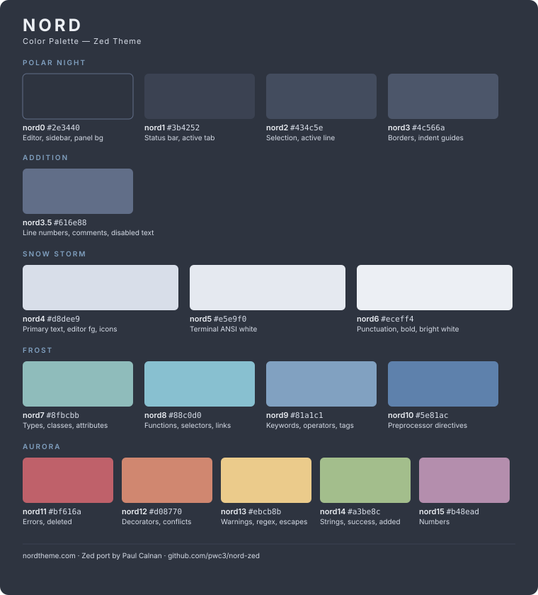

# Nord for Zed

A port of the [Nord](https://www.nordtheme.com) color scheme for the [Zed](https://zed.dev) editor, cross-referenced against the official [VSCode Nord theme](https://github.com/nordtheme/vscode).

## Color Palette

## Manual Installation

1. Download [`themes/nord.json`](themes/nord.json)
2. Place it in `~/.config/zed/themes/`
3. Restart Zed and select **Nord** from the theme picker (`cmd+k cmd+t`)

## License

MIT. This project is a derivative work of [Nord](https://github.com/nordtheme/nord) and [Nord for Visual Studio Code](https://github.com/nordtheme/visual-studio-code), both MIT licensed by Sven Greb.
